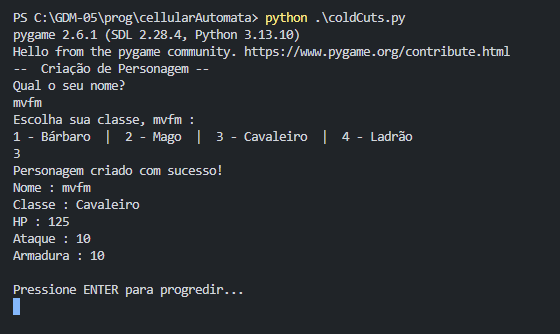
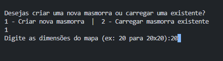
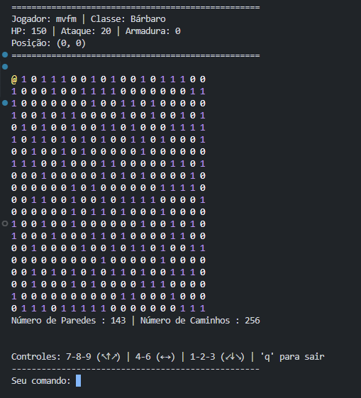

# cellularAutomata & coldCuts
Brincando com os princípios de cellular automata em python pra 'geração de cavernas' & um joguinho.

## Começando a jogar.
Para jogar o jogo em seu estado atual basta clonar o último commit do repositório
```
git clone https://github.com/Mvfm-25/cellularAutomata.git
```
Certifique-se de ter instalado um interpretador Python, 3.13 de preferência.

Tendo isso, basta entrar na pasta do repositório e rodar :
```
python .\coldCuts.py
```

## Música
Música por [kappemusic!](https://www.youtube.com/channel/UCSKAVQOJr3wTNs9klXg-QIg)

## Criação de personagens
Secção de criação de personagens, especificando nome, classe & seus atributos.
Cada classe possuí seus pontos de vida, pontos de ataque, armadura & precisão única. Maioria desses stats são escondidas pro jogador final, mas trazem diferenças significativas de gameplay.


## Escolha da Masmorra.
Criado seu personagem, o jogador é dada a escolha de criar uma nova masmorra ou escolher uma das inúmeras encontradas na pasta 'masmorras' do projeto.
Escolhendo criar uma nova masmorra, o jogador também escolhe as dimensões da caverna.


## Gameplay loop
O jogo em si.

O personagem do jogo é solto na primeira posição válida, encontrando-se em um labirinto cheio de perigos e tesouros! Caracteres pintados em vermelho representam inimigos! NPCs que o personagem do jogador consegue atacar para ganhar conhecimento! Por enquanto os NPCs não se movimentam pelo mapa, mantendo-se em seu lugar... Mas isso não os torna menos perigosos!

Sprites pintados em verde representam itens! Alguns lhe proporcionam riquezas ou conhecimento... Outros podem revelar caminhos antes não explorados...

