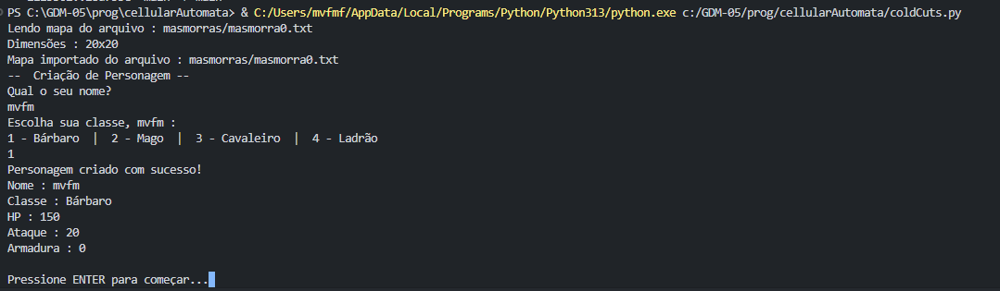

# cellularAutomata
Brincando com os princípios de cellular automata em python pra 'geração de cavernas'.

# Criação de personagens
Secção de criação de personagens, especificando nome, classe & seus atributos.
Ainda não final, mas seu esqueleto já está presente.

# Gameplay loop
O jogo em si. Por enquanto o jogador consegue apenas atravessar a masmorra.
